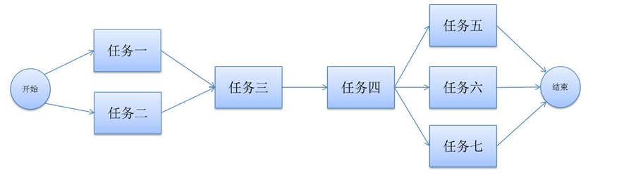

# processor
使用ForkJoin 实现多线程任务调度处理

我们通常会遇见这种情况需要 并行 串行任务按顺序处理




###如图执行顺序如下
* 任务一 任务二 异步执行
* 执行任务三
* 执行任务四
* 任务五，任务六，任务七异步执行


###IProcessor 任务需实现的接口

```
 /**
     * 任务id
     * @return
     */
    public String id();

    /**
     * 是否是异步
     * @return true 异步，false 同步
     */
    public boolean isAsyn();

    /**
     * 任务逻辑处理
     * @return
     */
    public Object process();
```

###ProcessorExecuteService 逻辑服务

···


    /**
     * 任务执行： 此方法完成之后，所有任务都已经调用完成
     * @return
     */
    public void execute(){
        ForkJoinPool pool = new ForkJoinPool();
        pool.invoke(new ProcessorAction(chain));
    }

    /**
     * 异步执行任务
     */
    public Future executeAsync(){
        ForkJoinPool pool = new ForkJoinPool();
        future = pool.submit(new ProcessorAction(chain));
        return future;
    }

···


###使用多线程调度测试


```


        Test t = new Test();
        List<IProcessor> list = new CopyOnWriteArrayList<>();
        list.add(new Process1("任务一",true));
        list.add(new Process1("任务二",true));
        list.add(new Process1("任务三",false));
        list.add(new Process1("任务四",false));
        list.add(new Process1("任务五",true));
        list.add(new Process1("任务六",true));
        list.add(new Process1("任务七",true));


        long start = System.currentTimeMillis();
        ProcessorExecuteService processorPool = new ProcessorExecuteService(list);
        processorPool.executeAsync();

        System.out.println("end execute: " + (System.currentTimeMillis() - start));

        System.out.println(processorPool.getProcessorResult("任务一"));
        System.out.println(processorPool.getProcessorResult("任务二"));
        System.out.println(processorPool.getProcessorResult("任务三"));
        System.out.println(processorPool.getProcessorResult("任务四"));
        System.out.println(processorPool.getProcessorResult("任务五"));
        System.out.println(processorPool.getProcessorResult("任务六"));
        System.out.println(processorPool.getProcessorResult("任务七"));

        System.out.println("end get : " + (System.currentTimeMillis() - start));
```

